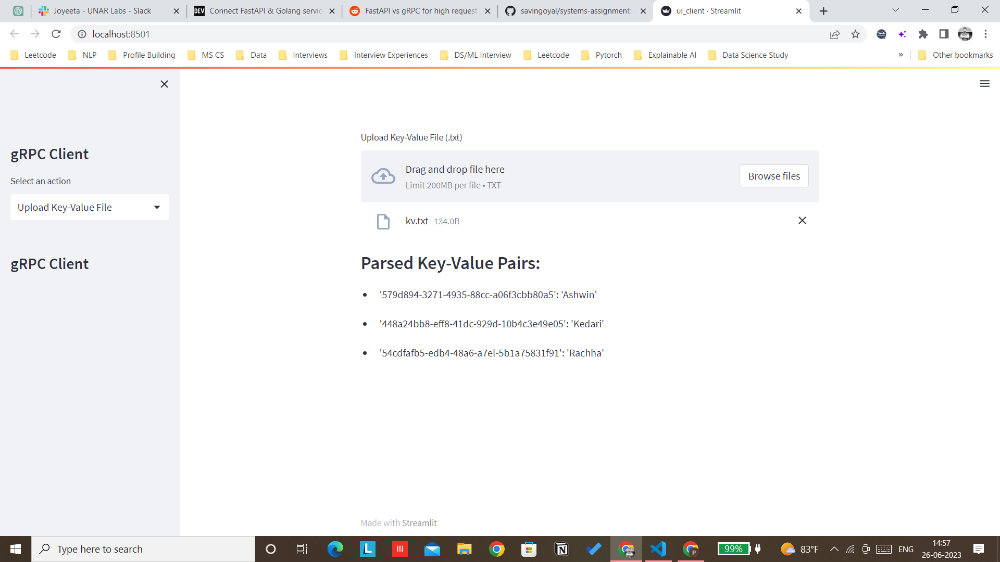

# KeyValueStore - Outerbounds Assessment 
### Author : Ashwin Rachha

**Deployed Version : https://kvstore.onrender.com/**

### Overview

This repository hosts a Simple Distributed  Key-Value store server implemented in two frameworks i.e FastAPI and gRPC. The server supports basic operations such as Get, Set and List.

### gRPC server

**********Usage**********

```python
1. cd grpc_server
2. make install

## Start the server (3 for example running on 4000, 4001, 4002)
3. cd python (open 3 seperate terminals if running on local box)
python server.py --ip 127.0.0.1:4000 -v 127.0.0.1:4001 127.0.0.1:4002
python server.py --ip 127.0.0.1:4002 -v 127.0.0.1:4000 127.0.0.1:4001
python server.py --ip 127.0.0.1:4001 -v 127.0.0.1:4002 127.0.0.1:4001

4. client.py --set 3479d894-3271-4935-88cf-a06f3cbb80a5=this_is_a_value --list -v
```

****************Features****************

The following gRPC server offers various benefits over other communication protocols such as http. 

- We make use of protocol buffers as the IDL (Interface Definition Language) which provides a compact binary serialization format (like JSON) but faster. The result is efficient data transmission, reducing bandwidth usage and improving overall performance.
- It also supports cross platform support for multiple programming languages. The same server which is written in Python can be simply written in Golang, C#, C++, Java and many other languages.
- gRPC supports bidirectional streaming, allowing both the client and server to send multiple messages asynchronously over a single connection. This capability is beneficial for real-time applications and scenarios that require continuous data exchange.

When combined with eventual consistency in a multi-server setup, gRPC can provide additional advantages:

1. **Scalability**: By using multiple servers, you can distribute the workload and handle increased traffic and data storage requirements. With eventual consistency, each server can operate independently, allowing for horizontal scaling and improved system performance.
2. **Fault Tolerance**: In the event of a server failure or network partition, the system can continue to operate with eventual consistency. Each server can handle its own updates independently, and the changes are propagated across servers asynchronously. This fault-tolerant approach ensures system availability and data integrity.
3. **Low Latency**: With gRPC's efficient communication and bidirectional streaming capabilities, servers can exchange updates in near real-time. This low-latency communication facilitates quick propagation of changes and reduces the time it takes for the entire system to achieve eventual consistency.
4. **Flexibility and Extensibility**: As the system evolves, you can add or remove servers without disrupting the overall functionality. With gRPC's support for dynamic service discovery and load balancing, new servers can be seamlessly integrated into the system, ensuring flexibility and extensibility.





### FastAPI Server

**********Usage**********

```python
cd fastapi_server
python server.py

# Hower on to localhost:8000/docs and use Swagger UI to post and retrieve keys
```
